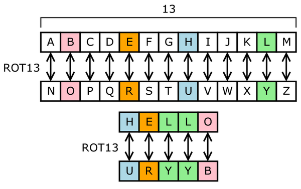

# Projeto 07 - Pseudo Device Driver

## Discente

+ Jhonatan Cléto, RA 256444

<!-- ## Apresentação -->

## Tema

Neste projeto implementamos um __Pseudo Device Driver__ para o kernel [__Linux__](https://pt.wikipedia.org/wiki/Linux_(n%C3%BAcleo)), mais especificamente implementamos um __Character Device Driver__ (CDD). O pseudo device implementado é um dispositivo criptográfico que trabalha com a [__Cifra de César__](https://pt.wikipedia.org/wiki/Cifra_de_C%C3%A9sar). A Cifra de César é uma [__Cifra de Substituição__](https://pt.wikipedia.org/wiki/Cifra_de_substitui%C3%A7%C3%A3o) que trabalha com caracteres do alfabeto romano. A mensagem é cifrada através da substituição de seus caracteres, por meio de uma rotação predeterminada das posições das letras no alfabeto, uma ilustração da cifra é vista na Figura 1.

_**Figura 1**: Exemplo de uma Cifra de César (ROT13)_

O CDD é capaz de _codificar_ (_ENCODE_) e _decodificar_ (_DECODE_) mensagens, com um tamanho limitado pela memória do dispositivo. Adicionalmente, é possível alterar a rotação utilizada na cifra.

## Diretórios e Arquivos

### [src](src/)

Armazena os arquivos do código fonto do projeto, sendo eles:

+ [`ccdd.c`](src/ccdd.c): Código em C com a implementação do _Cipher CDD_ (CCDD).
+ [`ccdd_ioctl.h`](src/ccdd_ioctl.h): Cabeçalho com a definição de estruturas e macros relacionadas ao CCDD e suas operações.
+ [`Makefile`](src/Makefile): Arquivo para compilar o CCDD, seguindo os padrões do Linux.

### [test](test/)

Armazena a o código fonte da aplicação que utiliza o CCDD.

+ [`ccdd_app.c`](test/ccdd_app.c): Arquivo com o código fonte da aplicação.

### [assets](assets/)
Armazena arquivos utililizados na apresentação

## Estruturas de Dados

O projeto conta com duas estruturas de dados principais, sendo elas:

### __ccd_st__
Abstração do dispositivo criptográfico.

~~~C
typedef enum cc_mode
{
    ENCODE = 0, // Coficação
    DECODE     // Decoficação
} cc_mode_t;

typedef struct ccd_struct
{
    cc_mode_t mode; // Modo de Operação
    int rot; // Tamanho da Rotação
    int mod_n; // Limitar o conjunto de caracteres
    char mem[BSIZE]; // Memória do Dispositivo
    int mem_size; // Tamanho da memória
    int mem_used; // Memória em uso
} ccd_st;
~~~

### __ccd_cop_st__
Estrutura de dados utilizada nas operações aplicam a cifra a uma mensagem e/ou salvam uma mensagem no dispositivo.

~~~C
typedef enum ccdc_op
{
    APPLY_AND_SAVE = 0, // Aplica a cifra e salva o CDD
    APPLY_ONLY,        //  Apenas aplica a cifra
    SAVE_ONLY,        //   Salva a mensagem do CDD sem aplicar a cifra
    READ_AND_APPLY,  //    Lê a mensagem no CDD cifrando-a
    READ_ONLY       //     Apenas lê a mensagem no CDD
} ccdc_op_t;

typedef struct ccd_content_op_struct
{
    char buff[BSIZE];
    ccdc_op_t op;
} ccd_cop_st
~~~

### MACROS

+ `BSIZE`: Tamanho dos buffers utilizados no CCDD
+ `CCD_MGN`: _Magic Number_ das operações _IOCTL_ implementadas.

#### Operações _IOCTL_
+  `CC_GET_MODE`: Obter o modo de operação do CCDD
+  `CC_SET_MODE`: Alterar o modo de operação do CCDD
+  `CC_GET_ROT`: Obter a rotação utilizada na cifra
+  `CC_SET_ROT`: Alterar a rotação utilizada na cifra
+ `CC_GET_CONTENT`: Obter o conteúdo na memória do dispositivo
+ `CC_SET_CONTENT`: Alterar o conteúdo na memória do dispositivo
+ `CC_RESET_STATE`: Restaurar o estado padrão do dispositivo
+ `CC_GET_STATE`: Obter o estado do CCDD
+ `CC_SET_CONTENT`: Alterar o estado do CCDD

## API

~~~C

// Device File API
static int ccdd_open(struct inode *i, struct file *f);
static int ccdd_close(struct inode *i, struct file *f);
static ssize_t ccdd_read(struct file *f, char __user *buf, size_t size, loff_t *off);
static ssize_t ccdd_write(struct file *f, const char __user *buf, size_t size, loff_t *off);

// IOCTL API
static long int ccdd_ioctl(struct file *f, unsigned cmd, unsigned long arg);

~~~

### Device File API

API para acesso ao dispositivo por meio do [Vitual File System](https://en.wikipedia.org/wiki/Virtual_file_system) (VFS).

### IOCTL API

API para acesso ao dispositivo por meio da chamada de sistema [ioctl](https://man7.org/linux/man-pages/man2/ioctl.2.html).

## Estado Padrão do Dispositivo

Por padrão o CCDD opera no modo de __codificação__ (ENCODE), utilizando a cifra com __rotação de 13 caracteres no alfabeto__ conhecida como [ROT13](https://pt.wikipedia.org/wiki/ROT13) e a memória do dispositivo é inicialmente vazia (caracteres nulos `'\0'`).